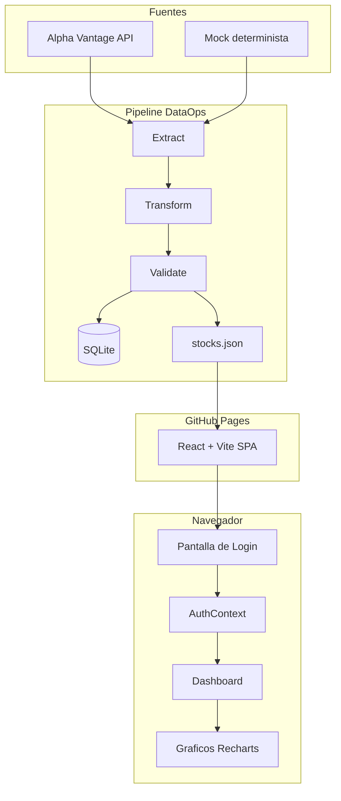
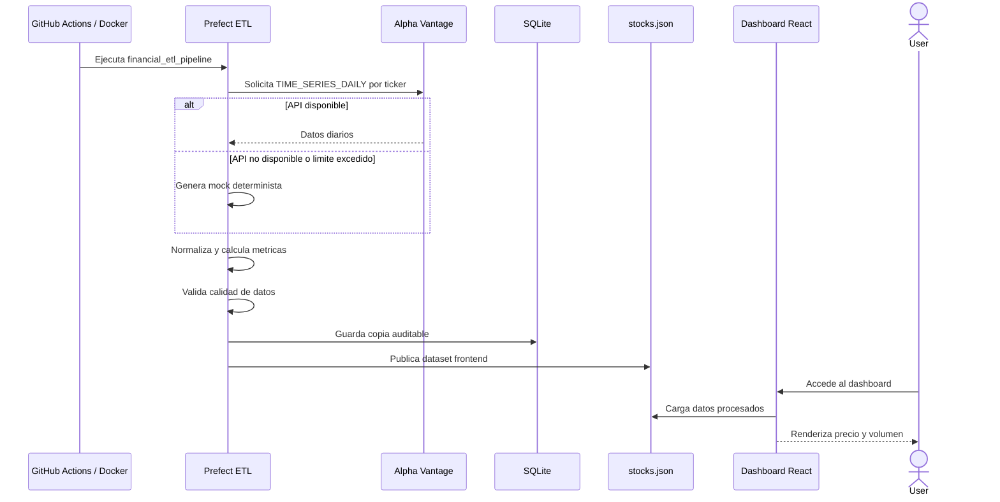
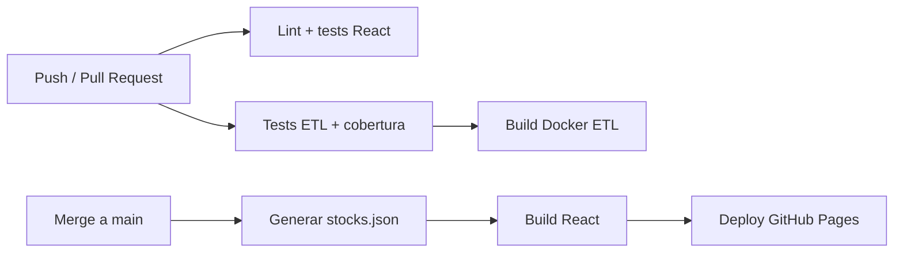

# Arquitectura - Financial Dashboard DataOps

## Descripcion general

Financial Dashboard DataOps es una Single Page Application construida con React y Vite que muestra un dashboard financiero con login, filtros de ticker y graficos interactivos. La aplicacion se alimenta prioritariamente de un dataset generado por un pipeline DataOps en Python.

El cambio principal respecto a una SPA puramente estatica es que la obtencion y preparacion de datos se mueve fuera del navegador. El pipeline extrae datos, los transforma, valida su calidad y publica un JSON listo para el frontend.

## Diagrama de arquitectura



## Flujo de datos



## Estructura relevante

```text
etl/
  flow.py                 Pipeline Extract, Transform, Validate, Load
  requirements.txt        Dependencias Python
  tests/test_flow.py      Tests del pipeline con cobertura
public/data/
  stocks.json             Dataset generado para el dashboard
src/
  services/stockService.js Lee stocks.json y usa API/mock como fallback
  pages/Dashboard.jsx     Dashboard financiero
.github/workflows/
  ci.yml                  Validacion frontend + ETL
  deploy.yml              Generacion dataset + build + GitHub Pages
Dockerfile.etl            Imagen del pipeline
Docker-compose.yml        Prefect server + worker ETL
```

## Decisiones de diseno

| Decision | Alternativa | Justificacion |
| --- | --- | --- |
| Prefect | Airflow | Menor complejidad operativa y suficiente para un ETL academico |
| JSON estatico | API backend | Compatible con GitHub Pages y facil de reproducir |
| SQLite | PostgreSQL | Trazabilidad local sin levantar infraestructura extra |
| Mock determinista | Mock aleatorio | Tests y demos reproducibles |
| React + Vite | Next.js | No se necesita SSR ni backend Node |
| HashRouter | BrowserRouter | Evita problemas de rutas en GitHub Pages |
| Docker Compose | Kubernetes | Complejidad adecuada para el alcance de la practica |

## Calidad de datos

El pipeline valida:

- columnas obligatorias;
- dataset no vacio;
- fechas no duplicadas por ticker;
- precios positivos;
- `high >= low`;
- volumen no negativo.

## CI/CD



## Despliegue objetivo AWS

La carpeta `infrastructure/` se reserva para el despliegue objetivo en AWS mediante Terraform. La arquitectura propuesta es ejecutar el pipeline en una instancia EC2 o tarea programada y publicar el dataset resultante para que el dashboard lo consuma.
