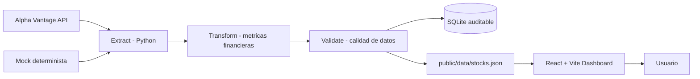

# Financial Dashboard DataOps

Proyecto para la asignatura **Metodologias de Desarrollo y Despliegue de Aplicaciones para Ciencia de Datos** del Master en Data Analytics.

La aplicacion combina una SPA de React + Vite con un pipeline DataOps en Python. El pipeline extrae datos financieros, los transforma, valida su calidad y publica un dataset JSON que alimenta el dashboard.

## Objetivo

Automatizar el flujo de datos de un dashboard financiero para evitar que el navegador dependa directamente de la API externa. La app puede seguir usando Alpha Vantage o datos mock como fallback, pero la fuente principal es el dataset procesado por el ETL.

## Arquitectura DataOps



## Flujo ETL

1. **Extract:** obtiene precios diarios de Alpha Vantage. Si no hay API key, falla la red o se supera el limite, usa datos mock deterministas.
2. **Transform:** normaliza tipos y calcula `daily_return`, `price_range`, `ma_7` y `ma_30`.
3. **Validate:** comprueba columnas obligatorias, precios positivos, volumen no negativo, fechas no duplicadas y coherencia `high >= low`.
4. **Load:** guarda una copia en SQLite y publica `public/data/stocks.json` para el frontend.

## Tecnologias

| Area | Tecnologia |
| --- | --- |
| Frontend | React 19, Vite 8, React Router, Recharts |
| Testing frontend | Vitest, React Testing Library |
| DataOps | Python 3.11, Prefect, pandas |
| Persistencia | SQLite y JSON estatico |
| CI/CD | GitHub Actions |
| Contenedores | Docker, Docker Compose |
| Infraestructura | Terraform / AWS como despliegue objetivo |

## Ejecucion local

### Frontend

```bash
npm install
npm run dev
```

La aplicacion se abre en `http://localhost:5173`.

Credenciales de demo:

| Usuario | Password |
| --- | --- |
| `administrador` | `viu2026` |

### Pipeline ETL

```bash
python -m venv .venv
.venv\Scripts\activate
pip install -r etl/requirements.txt
python -m etl.flow
```

El comando genera:

- `data/stocks.db`: copia SQLite para trazabilidad.
- `public/data/stocks.json`: dataset validado que consume React.

### Docker

```bash
docker compose up --build
```

Esto levanta Prefect UI en `http://localhost:4200` y ejecuta el contenedor ETL.

## Tests

```bash
npm run test
pytest etl/tests --cov=etl --cov-report=term-missing --cov-fail-under=70
```

La cobertura minima del ETL es del 70%, como exige el enunciado.

## CI/CD

- **CI:** en ramas de trabajo y pull requests ejecuta lint/test frontend, tests ETL con cobertura y build de la imagen Docker ETL.
- **CD:** en `main` valida el proyecto, ejecuta el ETL para generar `public/data/stocks.json`, construye React y despliega GitHub Pages.

## Tickers disponibles

- AAPL
- GOOGL
- MSFT
- AMZN
- TSLA

## Metodologia agil

El proyecto puede documentarse con Scrum/Kanban en tres sprints:

| Sprint | Objetivo | Resultado |
| --- | --- | --- |
| Sprint 1 | Dashboard base y autenticacion | Login, rutas protegidas, graficos y filtros |
| Sprint 2 | Pipeline DataOps | ETL, validaciones, SQLite, JSON para frontend |
| Sprint 3 | Industrializacion | Docker, CI/CD, documentacion y despliegue |

## Reproducibilidad

El dashboard funciona aunque Alpha Vantage no responda porque el ETL incluye datos mock deterministas. Esto permite ejecutar tests, demos y despliegues sin depender del limite gratuito de la API.
